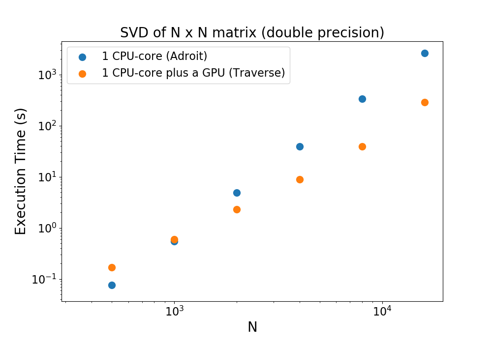

# Your First GPU Job

Using the GPUs on the Princeton HPC clusters is easy. Pick one of the applications below to get started. To obtain the materials to run the examples, use these commands:

```
$ ssh <NetID>@adroit.princeton.edu
$ cd /scratch/network/<NetID>
$ git clone https://github.com/PrincetonUniversity/gpu_programming_intro
```

## CuPy

[CuPy](https://cupy.chainer.org) provides a Python interface to set of common numerical routines (e.g., matrix factorizations) which are executed on a GPU (see the [Reference Manual](https://docs-cupy.chainer.org/en/stable/reference/index.html)). You can roughly think of CuPy as NumPy for GPUs. Note that the installation requires 3.5 GB of space. In general, software is installed in `/home` but because of the large size, the installation will be done on `/scratch/network` (see below).

Before installing the software make sure that you are on the head node:

```
$ hostname
adroit4
```

Then proceed as follows:

```
$ module load anaconda3
$ conda create --prefix /scratch/network/$USER/py-gpu cupy
```

Examine the Python script before running the code:

```bash
$ cd gpu_programming_intro/03_your_first_gpu_job/cupy
$ cat svd_cupy.py
```

Here is the Python script:

```python
from time import perf_counter
import numpy as np
import cupy as cp
# import cupyx.scipy.linalg

N = 1000
X = cp.random.randn(N, N, dtype=np.float64)
t0 = perf_counter()
u, s, v = cp.linalg.decomposition.svd(X)
# Y = cp.matmul(X, X)
# lu, piv = cupyx.scipy.linalg.lu_factor(X, check_finite=False)
cp.cuda.Device(0).synchronize()
elapsed_time = perf_counter() - t0

print("Execution time: ", elapsed_time)
print(cp.asnumpy(s).sum())
print("CuPy version: ", cp.__version__)
```

Below is a sample Slurm script:

```bash
#!/bin/bash
#SBATCH --job-name=cupy-job      # create a short name for your job
#SBATCH --nodes=1                # node count
#SBATCH --ntasks=1               # total number of tasks across all nodes
#SBATCH --cpus-per-task=1        # cpu-cores per task (>1 if multi-threaded tasks)
#SBATCH --gres=gpu:tesla_v100:1  # number of gpus per node
#SBATCH --mem=1G                 # total memory (RAM) per node
#SBATCH --time=00:00:30          # total run time limit (HH:MM:SS)
#SBATCH --reservation=introgpu   # REMOVE THIS LINE AFTER THE WORKSHOP

module purge
module load anaconda3
conda activate /scratch/network/$USER/py-gpu

srun python svd_cupy.py
```

Submit the job:

```
$ sbatch job.slurm
```

You can monitor the progress of the job with `squeue -u $USER`. Once the job completes, view the output with `cat slurm-*.out`. Did the operation run faster on the CPU with NumPy or on the GPU with CuPy? What happens if you re-run the script with the matrix in single precision?

In addition to CuPy, Python programmers looking to run their code on GPUs should also be aware of [Numba](https://numba.pydata.org/) and [JAX](https://github.com/google/jax).

## PyTorch

[PyTorch](https://pytorch.org) is a popular alternative to TensorFlow for deep learning researchers. See its documentation for [Tensor operations](https://pytorch.org/docs/stable/tensors.html). The installation requires 2.7 GB of space. In general, software is installed in `/home` but because of the large size the installation will be done on `/scratch/network`.

Before installing the software make sure that you are on the head node:

```
$ hostname
adroit4
```

Then proceed as follows:

```
$ module load anaconda3
$ conda create --prefix /scratch/network/$USER/torch-env pytorch cudatoolkit=10.1 --channel pytorch
```

Examine the Python script before running the code:

```bash
$ cd gpu_programming_intro/03_your_first_gpu_job/pytorch
$ cat svd_torch.py
```

Here is the application script:

```python
from time import perf_counter
import torch

N = 1000

cuda0 = torch.device('cuda:0')
x = torch.randn(N, N, dtype=torch.float64, device=cuda0)
t0 = perf_counter()
u, s, v = torch.svd(x)
elapsed_time = perf_counter() - t0

print("Execution time: ", elapsed_time)
print("Result: ", torch.sum(s).cpu().numpy())
print("PyTorch version: ", torch.__version__)
```

Here is a sample Slurm script:

```bash
#!/bin/bash
#SBATCH --job-name=torch-svd     # create a short name for your job
#SBATCH --nodes=1                # node count
#SBATCH --ntasks=1               # total number of tasks across all nodes
#SBATCH --cpus-per-task=1        # cpu-cores per task (>1 if multi-threaded tasks)
#SBATCH --mem-per-cpu=1G         # memory per cpu-core
#SBATCH --gres=gpu:tesla_v100:1  # number of gpus per node
#SBATCH --time=00:00:30          # total run time limit (HH:MM:SS)
#SBATCH --reservation=introgpu   # REMOVE THIS LINE AFTER THE WORKSHOP

module load anaconda3
conda activate /scratch/network/$USER/torch-env

srun python svd_torch.py
```

Submit the job:

```
$ sbatch job.slurm
```

You can monitor the progress of the job with `squeue -u $USER`. Once the job completes, view the output with `cat slurm-*.out`.

## TensorFlow

[TensorFlow](https://www.tensorflow.org) is popular library for training deep neural networks. It can also be used for various numerical computations (see [documentation](https://www.tensorflow.org/api_docs/python/tf)). The installation requires 3.0 GB of space. In general, software is installed in `/home` but because of the large size the installation will be done on `/scratch/network`.

Before installing the software make sure that you are on the head node:

```
$ hostname
adroit4
```

Then proceed as follows:

```
$ module load anaconda3
$ conda create --prefix /scratch/network/$USER/tf-gpu tensorflow-gpu=2.0
```

Examine the Python script before running the code:

```bash
$ cd gpu_programming_intro/03_your_first_gpu_job/tensorflow
$ cat svd_tensorflow.py
```

Here is the Python script:

```python
from time import perf_counter

import os
os.environ['TF_CPP_MIN_LOG_LEVEL'] = '1'

import tensorflow as tf
print("TensorFlow version: ", tf.__version__)

N = 100
x = tf.random.normal((N, N), dtype=tf.dtypes.float64)
t0 = perf_counter()
s, u, v = tf.linalg.svd(x)
elapsed_time = perf_counter() - t0
print("Execution time: ", elapsed_time)
print("Result: ", tf.reduce_sum(s).numpy())
```

Below is a sample Slurm script:

```bash
#!/bin/bash
#SBATCH --job-name=svd-tf        # create a short name for your job
#SBATCH --nodes=1                # node count
#SBATCH --ntasks=1               # total number of tasks across all nodes
#SBATCH --cpus-per-task=1        # cpu-cores per task (>1 if multi-threaded tasks)
#SBATCH --mem=1G                 # total memory (RAM) per node
#SBATCH --gres=gpu:tesla_v100:1  # number of gpus per node
#SBATCH --time=00:00:30          # total run time limit (HH:MM:SS)
#SBATCH --reservation=introgpu   # REMOVE THIS LINE AFTER THE WORKSHOP

module load anaconda3
conda activate /scratch/network/$USER/tf-gpu

srun python svd_tensorflow.py
```

Submit the job:

```
$ sbatch job.slurm
```

You can monitor the progress of the job with `squeue -u $USER`. Once the job completes, view the output with `cat slurm-*.out`.

### Benchmarks

Below is benchmark data for the SVD of an N x N matrix in double precision using NumPy with a single CPU-core on Adroit versus TensorFlow on Traverse using a single CPU-core and a V100 GPU:



## R with NVBLAS

Take a look at [this page](https://github.com/PrincetonUniversity/HPC_R_Workshop/tree/master/07_NVBLAS) and then run the commands below:

```
$ git clone https://github.com/PrincetonUniversity/HPC_R_Workshop
$ cd HPC_R_Workshop/07_NVBLAS
$ mv nvblas.conf ~
$ sbatch 07_NVBLAS.cmd
```

Here is the sample output:

```
[1] "Matrix multiply:"
   user  system elapsed 
  0.166   0.137   0.304 
[1] "----"
[1] "Cholesky Factorization:"
   user  system elapsed 
  1.053   0.041   1.096 
[1] "----"
[1] "Singular Value Decomposition:"
   user  system elapsed 
  8.060   1.837   5.345 
[1] "----"
[1] "Principal Components Analysis:"
   user  system elapsed 
 16.814   5.987  11.252 
[1] "----"
[1] "Linear Discriminant Analysis:"
   user  system elapsed 
 25.955   3.080  20.830 
[1] "----"
```

See the [user guide](https://docs.nvidia.com/cuda/nvblas/index.html) for NVBLAS.

## MATLAB

MATLAB is already installed on the cluster. Simply follow these steps:

```bash
$ cd gpu_programming_intro/03_your_first_gpu_job/matlab
$ cat svd_matlab.m
```

Here is the MATLAB script:

```matlab
gpu = gpuDevice();
fprintf('Using a %s GPU.\n', gpu.Name);
disp(gpuDevice);

X = gpuArray([1 0 2; -1 5 0; 0 3 -9]);
whos X
[U,S,V] = svd(X)
fprintf('trace(S): %f\n', trace(S))
quit;
```

Below is a sample Slurm script:

```bash
#!/bin/bash
#SBATCH --job-name=matlab-svd    # create a short name for your job
#SBATCH --nodes=1                # node count
#SBATCH --ntasks=1               # total number of tasks across all nodes
#SBATCH --cpus-per-task=1        # cpu-cores per task (>1 if multi-threaded tasks)
#SBATCH --mem-per-cpu=4G         # memory per cpu-core (4G is default)
#SBATCH --time=00:00:30          # total run time limit (HH:MM:SS)
#SBATCH --gres=gpu:tesla_v100:1  # number of gpus per node
#SBATCH --reservation=introgpu   # REMOVE THIS LINE AFTER THE WORKSHOP

module purge
module load matlab/R2019a

srun matlab -singleCompThread -nodisplay -nosplash -nojvm -r svd_matlab
```

Submit the job:

```
$ sbatch job.slurm
```

Here is an [intro](https://www.mathworks.com/help/parallel-computing/run-matlab-functions-on-a-gpu.html) to using MATLAB with GPUs.

## Julia

During the workshop use this command `salloc -t 5:00 --gres=gpu:k40c:1` as a substitute to the `salloc` command that appears in [this post](https://oncomputingwell.princeton.edu/2019/05/getting-started-with-julia-and-gpus). This is because the installation requires a few minutes which is too long to tie up the V100 GPUs.

## Monitoring GPU Usage

To monitor the GPU usage:

```
$ ssh adroit-h11g1   # 4x V100
$ nvidia-smi
```

```
$ ssh adroit-h11g4   # 2x K40c
$ nvidia-smi
```

To monitor jobs in our reservation:

```
$ watch -n 1 squeue -R <reservation-name>
```

## A Reminder About the Filesystems


The directions above indicate to perform the installations on `/scratch/network`. In general, one should store executables and source files in `/home`.

## Benchmarks

### Matrix Multiplication

| cluster              | code |  CPU-cores  | time (s) |
|:--------------------:|:----:|:-----------:|:--------:|
|  adroit (CPU)        | NumPy |    1       |  24.2    |
|  adroit (CPU)        | NumPy |    2       |  15.5    |
|  adroit (CPU)        | NumPy |    4       |   5.3    |  
|  adroit (V100)       | CuPy  |    1       |   0.3   |
|  adroit (K40c)       | CuPy  |    1       |   1.7   |

Times are best of 5 for a square matrix with N=10000 in double precision.

### LU Decomposition

| cluster              | code        |  CPU-cores | time (s) |
|:--------------------:|:-----------:|:----------:|:--------:|
|  adroit (CPU)        | SciPy       |    1       |   9.4   |
|  adroit (CPU)        | SciPy       |    2       |   7.9   |
|  adroit (CPU)        | SciPy       |    4       |   6.5   |  
|  adroit (V100)       | CuPy        |    1       |   0.3   |
|  adroit (K40c)       | CuPy        |    1       |   1.1   |
|  adroit (V100)       | Tensorflow  |    1       |   0.3   |
|  adroit (K40c)       | Tensorflow  |    1       |   1.1   |
|  adroit (CPU)        | Tensorflow  |    1       |  50.8   |

Times are best of 5 for a square matrix with N=10000 in double precision.

### Singular Value Decomposition

| cluster              | code       |  CPU-cores | time (s) |
|:--------------------:|:----------:|:----------:|:--------:|
|  adroit (CPU)        | NumPy      |    1       |    3.6   |
|  adroit (CPU)        | NumPy      |    2       |    3.0   |
|  adroit (CPU)        | NumPy      |    4       |    1.2   |
|  adroit (V100)       | CuPy       |    1       |   24.7   |
|  adroit (K40c)       | CuPy       |    1       |   30.5   |
|  adroit (V100)       | Torch      |    1       |   0.9    |
|  adroit (K40c)       | Torch      |    1       |   1.5    |
|  adroit (CPU)        | Torch      |    1       |   3.0    |
|  adroit (V100)       | TensorFlow |    1       |   24.8   |
|  adroit (K40c)       | TensorFlow |    1       |   29.7   |
|  adroit (CPU)        | TensorFlow |    1       |    9.2   |

Times are best of 5 for a square matrix with N=2000 in double precision.

For the LU decomposition using SciPy:

```
from time import perf_counter

import numpy as np
import scipy as sp
from scipy.linalg import lu

N = 10000
cpu_runs = 5

times = []
X = np.random.randn(N, N).astype(np.float64)
for _ in range(cpu_runs):
  t0 = perf_counter()
  p, l, u = lu(X, check_finite=False)
  times.append(perf_counter() - t0)
print("CPU time: ", min(times))
print("NumPy version: ", np.__version__)
print("SciPy version: ", sp.__version__)
print(p.sum())
print(times)
```

For the LU decomposition on the CPU:

```
from time import perf_counter

import os
os.environ['TF_CPP_MIN_LOG_LEVEL'] = '1'

import tensorflow as tf
print("TensorFlow version: ", tf.__version__)

times = []
N = 10000
with tf.device("/cpu:0"):
  x = tf.random.normal((N, N), dtype=tf.dtypes.float64)
  for _ in range(5):
    t0 = perf_counter()
    lu, p = tf.linalg.lu(x)
    elapsed_time = perf_counter() - t0
    times.append(elapsed_time)
print("Execution time: ", min(times))
print(times)
print("Result: ", tf.reduce_sum(p).numpy())
```
