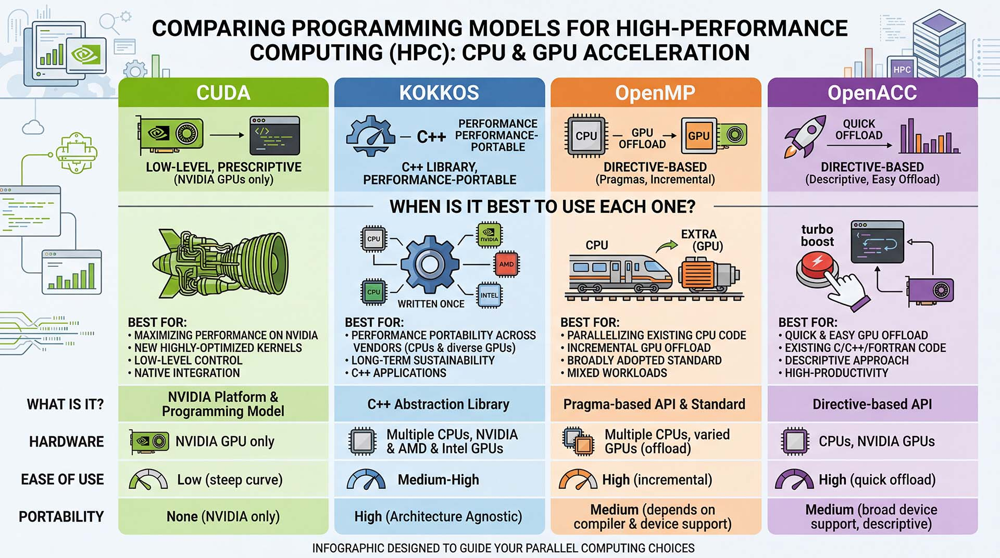

# Advanced and Other

## CUDA vs. Other GPU Programming Models

CUDA kernels are written at a low level. OpenMP, Kokkos and OpenACC are a high-level programmaing models. Because GPU hardware is changing rapidly, some argue that writing GPU codes with a high-level programmaing model is a better choice because there is much less work do to when new hardware comes out.

The figure below shows a comparison of popular GPU programming models:



## CUDA-Aware MPI

On Della you will see MPI modules that have been built against CUDA. These modules enable [CUDA-aware MPI](https://developer.nvidia.com/mpi-solutions-gpus) where
memory on a GPU can be sent to another GPU without concerning a CPU. According to NVIDIA:

> Regular MPI implementations pass pointers to host memory, staging GPU buffers through host memory using cudaMemcopy.

> With [CUDA-aware MPI](https://developer.nvidia.com/mpi-solutions-gpus), the MPI library can send and receive GPU buffers directly, without having to first stage them in host memory. Implementation of CUDA-aware MPI was simplified by Unified Virtual Addressing (UVA) in CUDA 4.0 – which enables a single address space for all CPU and GPU memory. CUDA-aware implementations of MPI have several advantages.

See the CUDA-aware MPI modules on Della:

```
$ ssh <NetID>@della.princeton.edu
$ module avail openmpi/cuda

------------- /usr/local/share/Modules/modulefiles -------------
openmpi/cuda-11.1/gcc/4.1.1  openmpi/cuda-11.3/nvhpc-21.5/4.1.1
```

## GPU Direct

[GPU Direct](https://developer.nvidia.com/gpudirect) is a solution to the problem of data-starved GPUs.


> Using GPUDirect™, multiple GPUs, network adapters, solid-state drives (SSDs) and now NVMe drives can directly read and write CUDA host and device memory, eliminating unnecessary memory copies, dramatically lowering CPU overhead, and reducing latency, resulting in significant performance improvements in data transfer times for applications running on NVIDIA Tesla™ and Quadro™ products

GPUDirect is enabled on `della` and `traverse`.


## Using the Intel Compiler

Note the use of `auto` in the code below:

```c++
#include <stdio.h>

__global__ void simpleKernel()
{
  auto i = blockDim.x * blockIdx.x + threadIdx.x;
  printf("Index: %d\n", i);
}

int main()
{
  simpleKernel<<<2, 3>>>();
  cudaDeviceSynchronize();
}
```

The C++11 language standard introduced the `auto` keyword. To compile the code with the Intel compiler for Della:

```
$ module load intel/19.1.1.217
$ module load cudatoolkit/11.7
$ nvcc -ccbin=icpc -std=c++11 -arch=sm_80 -o simple simple.cu
```

In general, NVIDIA engineers strongly recommend using GCC over the Intel compiler.
